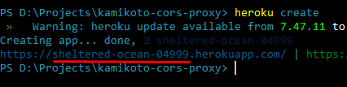

1. Установить [Heroku CLI](https://devcenter.heroku.com/articles/heroku-cli#download-and-install) и [залогиниться](https://devcenter.heroku.com/articles/heroku-cli#getting-started).
2. В папке с прокси в консноли выполнить:
    ```
    heroku create [*название приложения]
    ```
    *если не указывать, сгенерируется случайно
    ```
    git init
    heroku git:remote -a [*название приложения]
    ```
    *сгенерированное будет тут
    
    
    ```
    git add .
    git commit -m "init"
    git push heroku master
    ```
3. Вставить урл приложения **(без слеша на конце!)** в `src/Constants.ts` в `CORS_PROXY`

   
